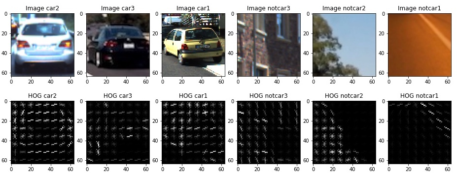
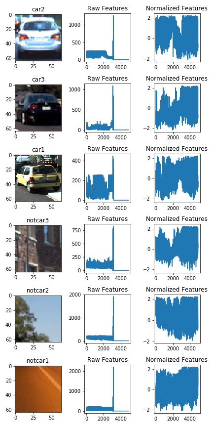
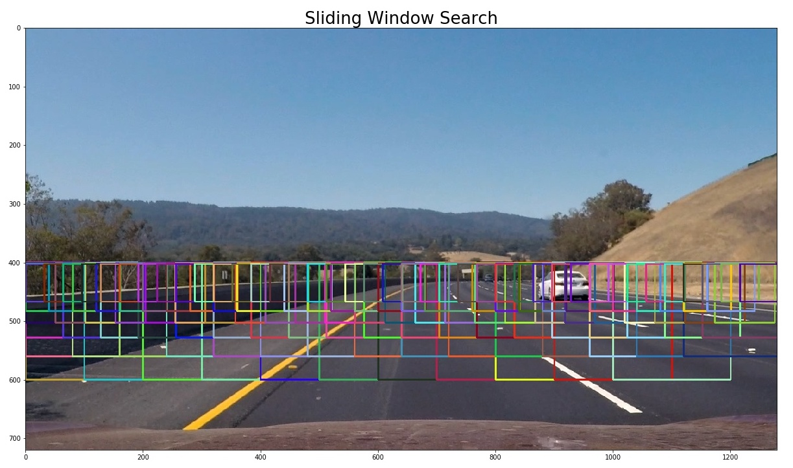
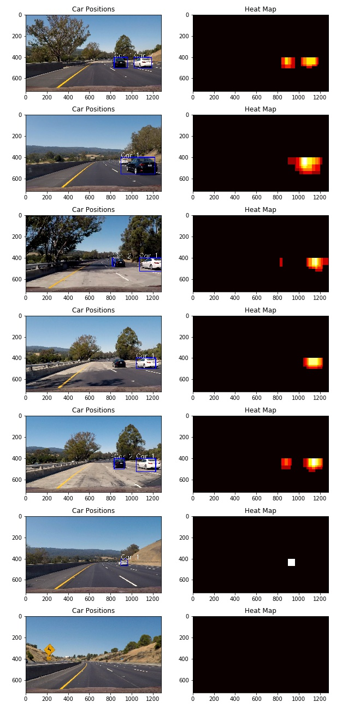

# Vehicle Detection Project**

The goals / steps of this project are the following:

* Perform a Histogram of Oriented Gradients (HOG) feature extraction on a labeled training set of images and train a classifier Linear SVM classifier
* Optionally, you can also apply a color transform and append binned color features, as well as histograms of color, to your HOG feature vector.
* Note: for those first two steps don't forget to normalize your features and randomize a selection for training and testing.
* Implement a sliding-window technique and use your trained classifier to search for vehicles in images.
* Run your pipeline on a video stream (start with the test_video.mp4 and later implement on full project_video.mp4) and create a heat map of recurring detections frame by frame to reject outliers and follow detected vehicles.
* Estimate a bounding box for vehicles detected.

## Features of Car Image

### Colour histograms

This is a histogram of the raw RGB pixel values. You can see a plot below:


### Raw Pixel Values

Raw pixel values can also be used to express features of the image. But to reduce the number of features, the pixel values are binned spatially. Below is plots of spatially binned pixel value in different colour spaces. It is found during later experimentation with the classifier that LUV space is the best at classifying cars. Although it is not immediately clear why when looking at the scatter plot. `notcar3` in particular looks very similar to a car image in the scatter plot hence would be difficult to classify correctly using raw pixel value alone.


### Histogram of Oriented Gradients (HOG)

HOG features pick out structural elements in the image by building histograms of gradients in small pixel blocks. The function `skimage.hog()` is used to calculate hog features. HOG feature of a few test images are plotted below. Here HOG is computed on the grey-scale image. `notcar3` which was difficult to distinguish using raw pixel values, shows up here with very distinct HOG signature.



### Combining and Normalising Features

All 3 features, colour histogram, spatially binned pixel values and HOG features are vectorised and concatenated. To prevent large value features dominating the classifier, the features needs to be normalized so that different feature components have relatively similar scale. I've used `sklearn.preprocessing.StandardScaler` function to achieve this. In the follow image it can be seen that the HOG features have very large scale in the pre-normalised plot where as in the normalized plot the features seem to have values on similar magnitude.



## Classifier

A simple linear support vector classifier is used. The "C" parameter is tuned automatically using the function GridSearchCV which searches through the parameter space to find the optimal parameter that gives the best accuracy.

The features used to train the classifier is also tuned by varying the below parameters and comparing the final test set accuracy. The final set of feature parameters are listed below:

```
cspace = 'LUV'
# spatial binning features
spatial = 8
# color histogram features
histbin = 512
hist_range = (0, 256)
# HOG features
orient=16
pix_per_cell=8
cell_per_block=2
```

The final feature vector length is 4864. It took 9.24 Seconds to train the SVC. The training Accuracy of SVC is 1.0 while the
test accuracy is 0.9924. The test accuracy is high and similar to training accuracy indicating that over-fitting is avoided. It takes 0.00124 Seconds to predict 10 labels with SVC.

## Sliding Window Search

Windows are moved across the image to take samples which are passed through the classifier.

- The windows are confined in the bottom half of the image because the top half consists of sky and mountains and is unlikely to contain cars.
- The windows get progressively smaller towards the middle of the image. Because the cars gets further away in this area and appear smaller.

The following image show the area and the windows searched.


## Filter for False Positives and Draw Bounding Boxes.

For each window where there is a positive detection, the pixels in that window are given a value of 1. When this value is added for all the windows we obtain a heat map. This can be seen in the plot below. This heat map have hotter areas where positively detected windows overlap. By applying a threshold to the heat map the areas with only a few window detected can be rejected as false positives.



By using the the function `scipy.ndimage.measurements.label()`, distinct blobs on the filtered heat map can be labelled. Pixels associated with a blob is given the blob number as the value. From there, I filtered by blob number and drawn bounding boxes around the filtered result. A text label is also drawn on the final image to indicate the blob number.

## Output Video

Here's a [link to my video result](output_videos/project_video_out.mp4)

## Discussion

### Problems
- It is suggested that to speed up HOG feature extraction one can extract HOG feature of the full image and sub-sample to get HOG feature of the windows. But as the windows have various size and go through sub-sampling before feature extraction, the sub sampling of hog does not exactly match with the HOG of the sub-sampled window. Maybe it would be possible to run HOG over the image at different sub-sampling scale and extract windows at the right scale.

### Possible Improvements

- Lane line detection data can inform the location of the sliding windows. We can crop out more areas and just look at the lanes area.
- Camera distortion can be corrected so that the cars don't deform due to camera artefacts.
- The location and size of the windows can be calculated from a projection matrix.
- The data sets are split for vehicles that are near, middle and far away as well as left and right. Hence it is possible to have different classifiers for different windows depending on window position and size.
- The pipeline is highly parallelizable. Each window can be classified independent of each other. Parallelizing the pipeline can dramatically speed up the detection.